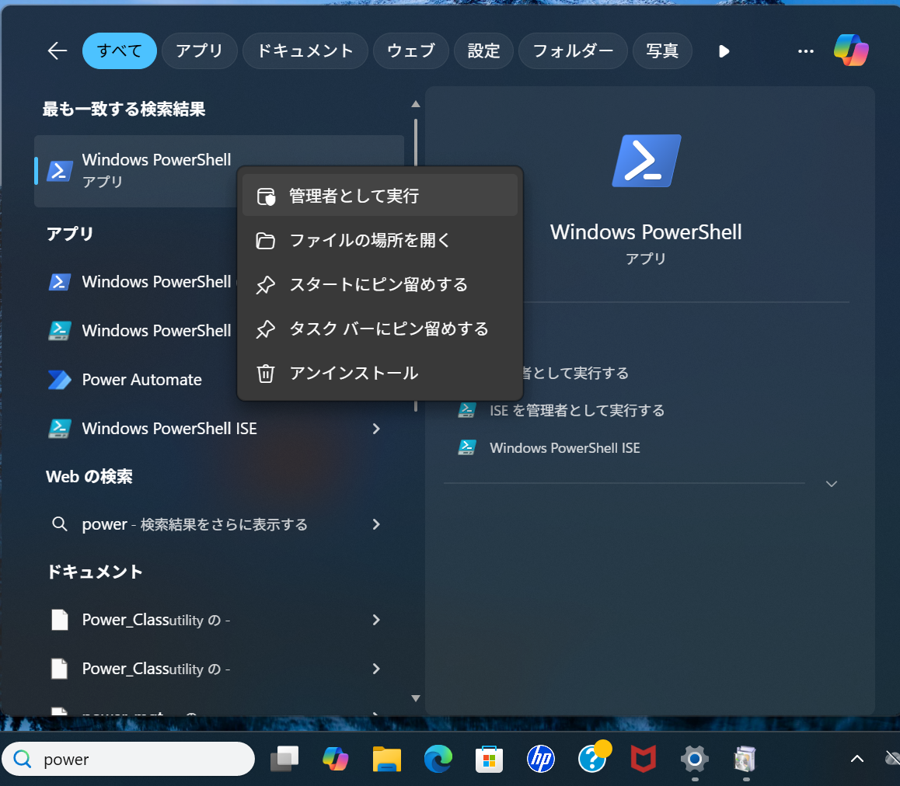
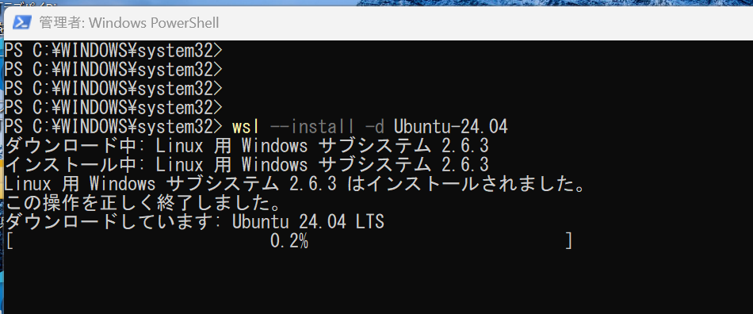
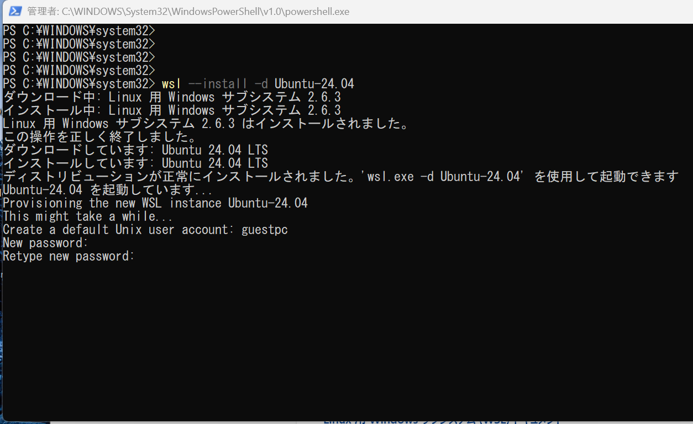
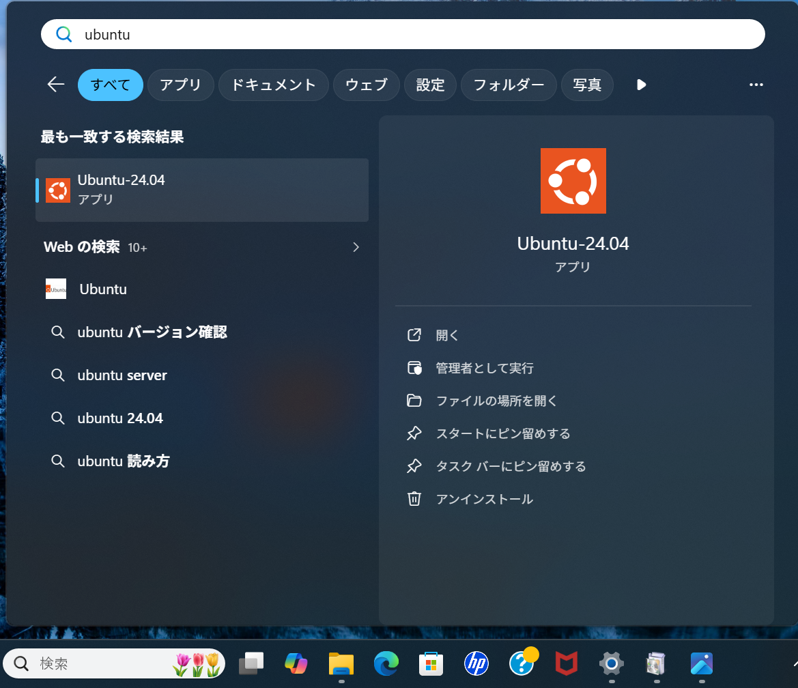
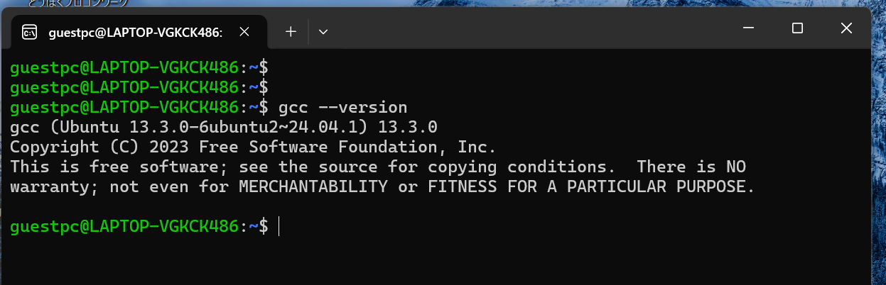

# 付録 : 自分の PC で C 言語の実習環境を作る

この付録では、Windows 11 の PC に WSL と Ubuntu 24.04 を導入し、C 言語のプログラムを実行できる環境を作る手順を説明します。
学校の Linux 環境とできるだけ近い形で学習できるように、Windows の中に Linux 環境を用意して、その中で C 言語の実習を行います。


## WSL とは

WSL (Windows Subsystem for Linux) は、Windows 上で Linux を動かすための仕組みです。  
これを使うと、Windows の PC でも Ubuntu などの Linux 環境を利用でき、Linux のコマンドや gcc などの開発ツールを使えます。


## 事前に確認しておくこと

作業を始める前に、次の点を確認しておきましょう。

- OS が Windows 11 であること
- インターネットに接続できること
- ソフトウェアのインストールができること
- 再起動が必要になる場合があること

では、WSL と Ubuntu をインストールし、 C 言語の開発環境を構築する手順を示していきます。

## 1. PowerShell を管理者として起動する

まず、Windows 側で操作を行います。

スタートメニューを開き、`PowerShell` と入力してください。  
表示された Windows PowerShell を右クリックし、「管理者として実行」を選びます。



## 2. WSL と Ubuntu 24.04 をインストールする

PowerShell が開いたら、以下のコマンドを実行し、WSL と Ubuntu をインストールします。

```:PowerShell
wsl --install -d Ubuntu-24.04
```
初めて WSL を入れる場合は、必要な機能の有効化やダウンロードが行われます。
途中で PC の再起動 を求められた場合は、再起動してください。
再起動後、インストールの続きが始まり、Linux のユーザー名とパスワードの設定に進みます。



## 3. Ubuntu のユーザー名とパスワードを設定する

WSL のインストールの最後、もしくは Ubuntu の初回起動時に、Linux 用のユーザー名とパスワードを設定します。
このユーザー名とパスワードは、Windows のログイン名やパスワードとは別物です。
Linux 側で sudo を使うときなどに必要になります。

次のように表示されます。

```bash: Powershell or Ubuntu
Enter new UNIX username:
New password:
Retype new password:
```

ユーザー名は、自分で分かりやすいものを決めてください。
パスワード入力中は、画面には文字が表示されませんが、正しく入力されています。



設定が終わると、Ubuntu の端末が使えるようになります。
## 4. Ubuntu を起動する

まず、 Ubuntu を起動します。
Windows のスタートから Ubuntu を検索し、`Ubuntu-24.04` というアプリを起動します。




端末が起動し、以下のようなプロンプトが表示されます。

```bash: Ubuntu
yourname@yourpc:~$
```

ここから先は Ubuntu 側の操作になります。

## 5. Ubuntu のパッケージ情報を更新する

Ubuntu を使い始めたら、最初にパッケージ情報を更新しておきましょう。

```bash: Ubuntu 
sudo apt update
sudo apt upgrade
```

sudo を使うときには、先ほど設定した Linux のパスワードが求められます。
入力して Enter を押してください。
更新には少し時間がかかる場合があります。
途中で `Do you want to continue? [Y/n]` と表示されたら、`Y` を入力して Enter を押します。

## 6. C言語の開発環境をインストールする

C言語のプログラムをコンパイルするために、必要なソフトウェアをインストールします。

```bash: Ubuntu
udo apt install build-essential
```

`build-essential` には、`gcc`、`make`、C の開発に必要なヘッダファイル類などが含まれます。

インストールできたら、次のコマンドで確認してみましょう。

```bash: Ubuntu
gcc --version
```

バージョン情報が表示されれば、`gcc` が利用できる状態です。




ようこそ、プログラミングの世界へ。
エラーを恐れず、試して、直して、また試すことを大切にしてください。