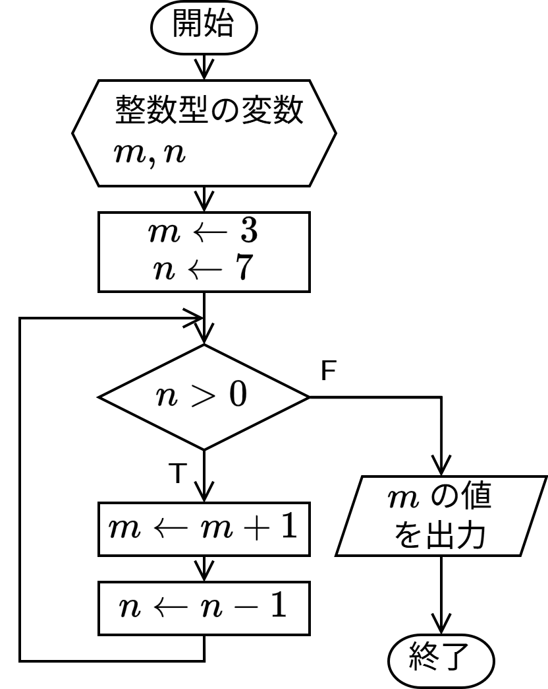
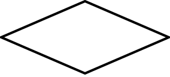

# Chapter 2
# 第 2 章 : C 言語の基礎

## 例題 2-1 : フローチャートによるプログラムの設計

プログラムの設計段階では、処理の流れを整理し、正しく処理が行得るかどうかを検討するため、フローチャートを作成するとよいです。

フローチャートの例を示します。




フローチャートは次の表に示すような要素を組み合わせて、処理の流れを表します。

|要素|説明|
|----|----|
| | 端子 : プログラムの開始や終了を表す|
|| 準備 : 使用する変数の宣言などを行う |
|| 処理 : 計算や変数の代入などをおこなう|
|| データ : プログラムへの入出力を表す|
|| 判断 : 条件を判断し処理を分岐する

例で示したフローチャートをもとにプログラムを作成すると以下のようになります。

フローチャートとプログラムがどのように対応しているか、確認してみてください。

```c : sample.c
#include <stdio.h>

int main(void) {
  int m, n;
  
  m = 3;
  n = 7;

  while (n > 0) {
    m = m + 1;
    n = n - 1;
  }

  printf("%d\n", m);

  return 0;
}
```

なお、このプログラムを実行すると端末に `10` と表示されます。

---

## 例題 2-2 : Hello, World!

次のプログラムは、標準出力 (ターミナル) へ `Hello, World!` と表示するプログラムです。

ソースコード中の　`//` は単一行コメントの開始を表す記号で、`//` から右側行末まではコメントとして扱われます。コンパイラはコメント部分は無視してコンパイルを行います。
(ですので、コメント部分はプログラムに記入する必要はありません。)

プログラムを作成し、コンパイルを行って実行してみましょう。

``` c : hello.c
#include <stdio.h>  // (1)

int main(void) {    // (2-1)
  printf("Hello, World!\n");  //(3)

  return 0; // (4)
} // (2-2)
```

プログラムの各部分について説明していきます。

```c :
#include <stdio.h>  // (1)
```

`#include` はプリプロセッサディレクティブと呼ばれるもののひとつで、指定したファイルをソースコードに組み込むときに使用します。
ここでは、 `stdio.h` というファイル(ヘッダファイル)が指定されています。
`stdio.h` では標準入出力を処理する関数などが宣言されており、
このヘッダファイルを読み込むことで、
端末に指定した文字列を表示する `printf` や、
端末からの入力を受け取る `scanf` などの関数を使えるようになります。

``` c :
int main(void) {    // (2-1)
  ...(中略)
} // (2-2)
```
C 言語で作成したプログラムは、実行すると(通常)はじめに `main` 関数が呼び出されます。
ここではその `main` 関数を定義しています。

関数の定義では、関数名と関数に渡す値(引数)の型、関数が返す値(返り値)の型を指定します。
このプログラムでは、関数名として `main` 、引数の型として `void` 型(空であること示す型)、返り値の型として `int` 型(整数型)が指定していまうｓ。
なお、`main` 関数の返り値の方は `int` 型となります。
(`main` 関数に引数を渡すこともできますが、詳細は 10 章で説明します。)

関数の本体で行う処理を `{` と `}` で囲まれた部分に記述します。

``` c :
  printf("Hello, World!\n");  //(3)
```
`printf` は引数で指定した文字列を標準出力へ出力する命令です。
引数で渡された `"` (ダブルクォート)で囲まれた文字列を出力します。
文字列中の `\n` は改行文字を表し、出力時はこの部分で改行が行われます。

``` c :
  return 0; // (4)
```
`return` 文は関数(ここでは `main` 関数)の実行を終了し、関数の呼び出し元に返す値を設定する命令です。

`main` 関数は正常に終了すると整数値 `0` を返します。


このプログラムをコンパイルし、実行すると次のように `Hello, Wold!` と表示し改行されます。

``` : 端末
$ gcc hello.c -o hello
$ ./hello
Hello, world!
$
```

> **tips**
> `man` コマンドを使うとシステムで提供されている C 言語の関数や、ファイルなどに関する情報が得られます。
> `stdio` や `printf` などについて `man` コマンドを使って調べてみましょう。

``` : 端末
$ man stdio
STDIO(3)          Linux Programmer's Manual          STDIO(3)

NAME
       stdio - standard input/output library functions

SYNOPSIS
       #include <stdio.h>

       FILE *stdin;
       FILE *stdout;
       FILE *stderr;

DESCRIPTION
       The  standard  I/O library provides a simple and effi‐
       cient buffered stream I/O interface. (以下略)
```

---

## 演習


### 演習 2-1 

次のプログラムの `Ayshi Hanako` の部分を自分の名前に変更したプログラムを作成し、コンパイルし実行して、その動作を確認しましょう。

``` c : name.c
// IS 99 愛子花子
#include <stdio.h>

int main(void) {
  printf("Hi, ");
  printf("Ayashi Hanako");
  printf("!\nHow are you?\n");

  return 0;
}
```
---

### 演習 2-2

実行すると端末に以下のように表示されるプログラムを作成してください。
作成したプログラムをコンパイルして動作を確認しましょう。

``` : 端末
Have fun with 

 CCC
C
C
 CCC PROGRAMMING!
```

### 演習 2-3 

次のプログラムを作成し、実行しましょう。

``` c : fizzbuzz.c
#include <stdio.h>

#define MAX_COUNT 42

int main(void) {
  int count = 1;

  while (count <= MAX_COUNT) {
    if (count % 15 == 0) {
      printf("FizzBuzz\n");
    } else if (count % 3 == 0) {
      printf("Fizz\n");
    } else if (count % 5 == 0) {
      printf("Buzz\n");
    } else {
      printf("%d\n", count);
    }
    count = count + 1;
  }

  return 0;
}
```