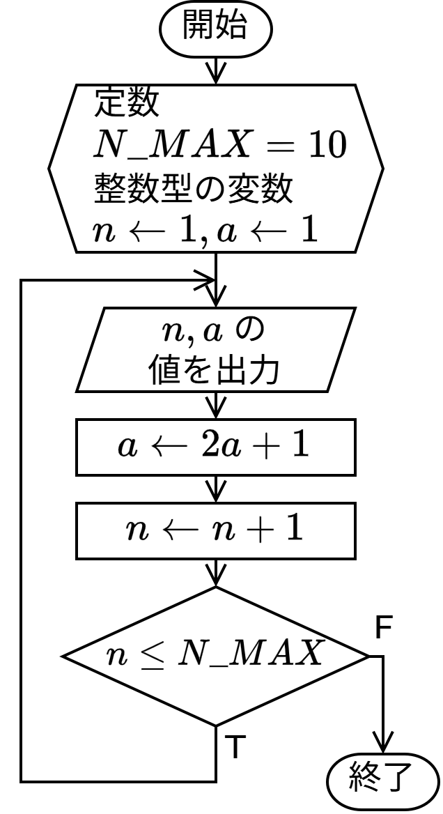

# 第 3 章 : 変数とデータ型

C 言語では数値や文字などのデータを保持しておく変数を用いることができます。また、変数およびデータには、そのデータの種類を定める型(type)があります。

C言語で用いる主なデータ型を以下の表に示します。

| 型名 | 説明 |
| ----------- | --- | 
| `char` | 8 ビットの整数値(127~-128)を表す。<br>通常はその値を文字コード(ASCII)とする文字('a', '2', '@'など)を表すのに使用される。|
| `int` | 32 ビットの整数値 (2147483647 ~ -2147483648) を表す。(実習室の環境の場合)|
| `unsigned char` | 8 ビットの符号なし整数値 (0 ~ 255) を表す。|
| `unsigned int` | 32 ビットの符号なし整数値 (0 ~ 4294967295) を表す。|
| `float` | 32 ビットの浮動小数点数(指数部 8 ビット, 仮数部 23 ビット)を表す。<br> 最大値 (約) \\(3.40\times 10^{38}\\) ~ (正の)最小値 (約) \\(1.18\times 10^{-38}\\), 有効桁数 6 桁程度|
| `double` | 64 ビットの浮動小数点数(指数部 11 ビット, 仮数部 52 ビット)を表す。<br> 最大値 (約) \\(1.80\times10^{308}\\) ~ (正の)最小値 (約) \\(2.20\times 10^{-308}\\), 有効桁数 15 桁程度 |


### 例題 3-1 : 変数の宣言と値の代入

次のプログラムは変数を用いたデモプログラムです。
変数を用いるときは、型と変数名を指定して宣言します。
宣言した変数には値を代入することができます。


``` c : variables1.c
#include <stdio.h>

int main(void) {
  // (1) 変数の宣言
  char character;
  int i, num;
  double temperature;

  // (2) 変数への値の代入
  character = 'z';
  i = 42;
  num = i + 10;   // num <- 52 (= 42 + 10)
  temperature = -3.4;

  // (3) 変数の値の表示
  printf("%c\n", character);  
  printf("%d\n", i);
  printf("%d\n", num);
  printf("%f\n", temperature);

  return 0;
}
```

プログラムの説明をしていきます。

変数を用いる際には、まず変数の型(データ型)と変数名を示して宣言する必要があります。
``` c :
  // (1) 変数の宣言
  char character;
  int i, num;
  double temperature;
```
これにより、char 型の変数 `character` と、int 型の変数 `i` および `num`、
double 型の変数 `temperature` が使えるようになりました。
なお、変数を宣言しただけではその変数の値は不定となります。

変数へ値を代入するときは代入演算子 `=` を使います。
``` c :
  // (2) 変数への値の代入
  character = 'z';
  i = 42;
  num = i + 10;
  temperature = -3.4;
```
代入演算子 `=` の左辺には、代入先となる変数を置き、
右辺には代入する値や式を持ってきます。

`character = 'z';` が実行されると、char 型の変数 `character` に 1 文字の値 `'z'` が代入されます。
同様に `i = 42;` が実行されると、int 型の変数 `i` に整数値 42 が代入されます。

代入演算子の右辺に式を持ってくることもできます。
`num = i + 10;` を実行すると、まず右辺の足し算が計算されます。
いま、変数 `i` には 42 が代入されているので、`i + 10` の計算結果は 52 となります。この計算結果の値が、変数 `num` に代入されます。

変数の値を表示するには `printf` を用いるとよいです。
`printf` 関数の詳しい使い方については 4 章で説明します。

``` c :
  // (3) 変数の値の表示
  printf("%c\n", character); // char 型の変数 character の値を文字として表示 
  printf("%d\n", i);         // int型の変数 i の値を10進数表示で表示
  printf("%d\n", num);       // int型の変数 num の値を10進数表記で表示
  printf("%f\n", temperature);  // double型の変数 temperature の値を浮動小数点数として表示
```

プログラムの実行結果を示します。
上から順に char 型の変数 `character`、int 型の変数 `i`、`num`、double 型の変数 `temperature` の値が表示されます。

``` : 端末
z
42
52
-3.400000
```

---
### 例題 3-2 : 変数の宣言時での代入(初期化)

変数の宣言時と同時に変数の値を代入することもできます。
これを変数の初期化といいます。
変数の初期値が決まっている変数に対しては、変数の初期化を行うとよいでしょう。

変数の初期化を用いたプログラムを示します。

```c : variables2.c
#include <stdio.h>

int main(void) {
  // 変数の宣言時に値を設定
  char character = 'P';
  int num = -57;
  double temperature = 12.34;

  printf("%c\n", character);  
  printf("%d\n", num);
  printf("%f\n", temperature);

  return 0;
}
```

プログラムの実行結果を示します。

``` : 端末
P
-57
12.340000
```

---

### 例題 3-3 : 代入による変数の上書き

変数への代入は 1 度だけでなく複数回行うことができます。

次のプログラムでは、`int` 型の変数 `i` と `j` に対して、
変数宣言時に初期化を行った後、
それぞれの変数に対して 2 回代入を行っています。
初期化、1 回目の代入、2 回目の代入それぞれが行われた直後で
変数 `i` と `j` の値がどのように変化しているか、
プログラムを実行して確かめてください。

```c : variables3.c
#include <stdio.h>

int main(void) {
  // (1) 初期化
  int i = 10;
  int j = 20;
  printf("(1) initializations \n");
  printf("i = %d\n", i);  
  printf("j = %d\n", j);

  // (2) 代入
  i = 30; 
  j = i; 
  printf("(2) assignments \n");
  printf("i = %d\n", i);  
  printf("j = %d\n", j);

  // (3) さらなる代入
  i = i + 2;   // i <- 32 (= 30 + 2)
  j = 3 * j;    // j <- 90 (= 3 * 30)
  printf("(3) more, \n")
  printf("i = %d\n", i);  
  printf("j = %d\n", j);

  return 0;
}
```

プログラムの実行結果を示します。
変数 `i` と `j` の値がどのように変化しているか、
プログラムと対応させて確認してください。

``` : 端末
(1) initializations
i = 10
j = 20
(2) assignments
i = 30
j = 30
(3) more,
i = 32
j = 90
```

さて、2 回目の代入では代入演算子 `=` の左辺と右辺に同じ変数が現れています。
``` c :
  // (3) さらなる代入
  i = i + 2;
  j = 3 * j;
```
このような場合は、代入が行われる前の変数の値を使って右辺の式が評価され、
その値が、左辺の変数に代入されることになります。
例えば、`i = i + 2;` が行われる前では、`i` には値 `30` が格納されていますが、
`i = i + 2;` が実行されると `i` の値は `32` となります。

なお、このプログラムの処理の流れをフローチャートで示すと、
以下のようになります。


---
### 例題 3-4 : キャストによる型の変換

変数への代入を行うときは、左辺の変数と右辺の値のデータ型が一致している必要があります。

int 型の変数に double 型の値を代入したり、逆に double 型の変数に int 型の値を代入したりしようとする場合は、キャストと呼ばれる機能を用いて、一時的にデータの型を変換します。

次のプログラムは、キャストによって、`int` 型の値を `double` 型に変換したり、
その逆を行っています。

```c : cast.c
#include <stdio.h>

int main(void) {
  int i = 256;
  double x = -12.34;
  double d_i;
  int i_x;

  // (1) int 型の値を double 型に変換
  d_i = (double)i;
  printf("i   = %d\n", i);
  printf("d_i = %f\n", d_i);

  // (2) double 型の値を int 型に変換
  i_x = (int)x;
  printf("x   = %f\n", x);
  printf("i_x = %d\n", i_x);

  return 0;
}
```

(1) の `d_i = (double)i` での代入では、
int 型の変数 `i` の値を double 型に変換して `d_i` に代入しています。

一方、(2) の `i_x = (int)x` での代入では、double 型の変数 `x` の値 `-12.34`を int 型に変換して `i_x` に代入しています。
この時、小数点以下は切り捨てられ、整数値 `-12` が `i_x` に代入されます。

プログラムの実行結果を示します。

``` : 端末
i   = 256
d_i = 256.000000
x   = -12.340000
i_x = -12
```

---

## 演習

### 演習 3-1 

プログラム `semicircle.c` は半径 `r` の半円の面積を求めて
表示するプログラムです。
このプログラムは次のフローチャートをもとに作成しました。


プログラム中、変数 `r` の値を自分が好きな実数値に変更して、プログラムを実行し、動作結果を確認してください。

```c : semicircle.c
#include <stdio.h>

int main(void) {
  double r, area;

  r = 3.0; // この値を変更する。

  area = 3.14 * r * r / 2;

  printf("The area of semicircle of ");
  printf("radius %f is %f.\n", r, area);

  return 0;
}
```

---

### 演習 3-2 

以下に示すプログラムは、
初項 \\( a_1 = 1 \\)、漸化式 \\( a_{n+1} = 2 a_n + 1\ (0 \le n) \\) で定まる数列 \\(a_n\\) を
初項から第 10 項まで計算して表示するプログラムです。
プログラムを実行して、動作結果を確認してください。

``` c : sequence.c
#include <stdio.h>

#define N_MAX 10

int main(void) {

  int n = 1;
  int a = 1;

  do {
    printf("n = %d : %d\n", n, a);
    a = 2 * a + 1;
    n++;
  } while (n <= N_MAX);

  return 0;
}
```

このプログラムの処理の流れをフローチャートで示すと以下のようになります。


