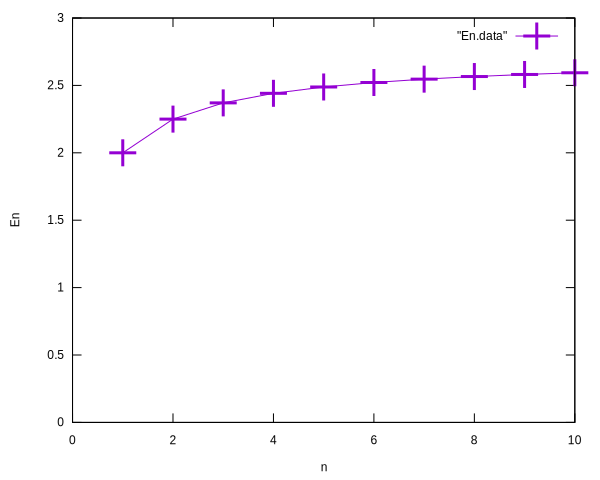

# 演習課題

## 課題 1. 扇形の面積

正の実数 \\(r\\) と 0 以上 360 以下の実数 \\(\theta\\) を入力すると、
半径が \\(r\\) で中心角を \\(\theta \[^{\circ}\]\\) とする扇形の面積を計算して、
出力するプログラムを作成してください。
ただし、円周率 \\(\pi\\) は 3.14 として扇型の面積を計算してください。
中心角は度数法で与えられているに注意しましょう。

期待されるプログラムの実行例を示します。
1 行目と 2 行目はユーザーからの入力で、
1 行目では \\(r\\) の値、2 行目では \\(\theta\\) の値を入力しています。
3 行目がプログラムの出力で扇形の面積を求めて出力しています。

```: 端末
12.3
60.0
79.175100
```

---

## 課題 2. 自販機のお釣り

ジュースなどの飲料品を販売している自動販売機を考えます。
この自動販売機に 1000 円札を投入し、170 円のジュースを購入したとすると、お釣りとして 830 円が返ってきます。
この時、お釣りの硬貨の枚数を最小限となるようにお釣りが返されると、 500 円硬貨 1 枚、100 円硬貨 3 枚、10 円硬貨 3 枚 が返されます。

このように、投入金額と購入商品の金額を入力を入力すると、お釣りとして返される硬貨の枚数が最小限となるように計算して出力するプログラムを作成しましょう。

入力される投入金額と購入商品の金額は、10 円以上 1000 円以下とし、 10 円単位の整数値で入力されるものとします。投入金額は購入商品の金額以上とします。

出力としては、お釣りとして返される 500 円硬貨、100 円硬貨、50円硬貨、10 円硬貨の枚数をそれぞれ出力してください。

期待されるプログラムの実行例を 2 つ示します。
それぞれ 1 行目と 2 行目はプログラムへの入力で、
1 行目が投入金額、2 行目が購入商品の金額の入力を示しています。
3 行目から 6 行目がプログラムの出力で、
上からおつりとして返される 500円硬貨、100 円硬貨、 50 円硬貨、 10 円硬貨の枚数を表します。

- 実行例 1 : 投入金額 1000 円、購入商品の金額が 170 円の場合 
``` : 端末
1000
170
500: 1
100: 3
 50: 0
 10: 3
```

- 実行例 2 : 投入金額 510 円、購入商品の金額が 160 円の場合
``` : 端末
510
160
500: 0
100: 3
 50: 1
 10: 0
```
---


## 課題 3. 二次方程式の解

実係数 \\(b, c\\) を持つ \\(x\\) についての二次方程式 \\(x^2 + b x + c = 0\\) は、
その判別式 \\( D = b ^ 2 - 4 c\\) の値によって以下に示すような解を持ちます。

1. \\(D > 0\\) の場合 : 2 個の実数解 \\(x_1, x_2\\)
\\[x_1 = \dfrac{-b + \sqrt{D}}{2}, \ 
   x_2 = \dfrac{-b - \sqrt{D}}{2}.
\\]

2. \\(D = 0\\) の場合 : 1 個の実数解(重解) \\(x_1\\)
\\[x_1 = \dfrac{-b}{2}. \\]

3. \\(D < 0\\) の場合 : 2 個の複素数解 \\(x_1, x_2\\)
\\[x_1 = \dfrac{-b}{2} + \mathrm{i} \dfrac{\sqrt{-D}}{2}, \ 
   x_2 = \dfrac{-b}{2} - \mathrm{i} \dfrac{\sqrt{-D}}{2}.
\\]
  (\\(\mathrm{i}\\) は虚数単位)


2 個の実数値 \\(b, c\\) を入力すると
\\(x\\) についての二次方程式 \\(x^2 + b x + c = 0\\) の解を、
以下に示す実行例のようにすべて求めて表示するプログラムを作成してください。
なお、平方根の計算については、[平方根の計算](#平方根の計算)を参照してください。

実行例を示します。
それぞれ 1 行目がプログラムへの \\(b, c\\) の値の入力を表します。
2 行目以降がプログラムの出力です。

- 実行例 1 : 2 個の複素数解を持つ場合
``` : 端末
3.0 1.0
x1 = -0.3819660
x2 = -2.6180340
```

- 実行例 2 : 1 個の実数解(重解)を持つ場合
``` : 端末
2.0 1.0
x1 = -1.0000000
```

- 実行例 3 : 2 個の複素数解を持つ場合
``` : 端末
2.0 3.0
x1 = -1.0000000 + i  2.8284271
x2 = -1.0000000 - i  2.8284271
```

~~~admonish tip
### 平方根の計算

平方根の計算を計算するときは、
標準ライブラリ `math.h` で提供されている `double sqrt(double x)` 関数を使うことができます。
この関数は、引数に与えた値の平方根を計算して返します。引数は 0 以上の値である必要があります。

sqrt 関数の使い方を示すプログラムを以下に示します。
sqrt 関数を使うためには、`#include <math.h>` をプログラムの先頭に書く必要があります。
このプログラムは、実数 \\(2.0\\) の平方根\\(\sqrt{2.0}\\) の値を計算して出力します。

```c : sqrt.c
#include <stdio.h>
#include <math.h> // sqrt 関数を使うために必要なヘッダファイル

int main(void) {
    double x = 2.0;
    double y = sqrt(x); // x の平方根を計算
    printf("sqrt(%f) = %f\n", x, y);
    return 0;
}
```

`math.h` をインクルードしたプログラムをコンパイルするときは、
以下のように `-lm` オプションを付けてコンパイルする必要があります。
`-lm` オプションは、数学ライブラリをリンクするためのオプションです。

``` : 端末
$ gcc sqrt.c -o sqrt -lm
```

実行結果を示します。
```: 端末
$ ./sqrt
sqrt(2.000000) = 1.414214
```

~~~

---

## 課題 4. ネイピア数の近似

1 以上の自然数 \\(n\\) に対して、\\(E_n\\) を
\\[ E_n = \left(1 + \dfrac{1}{n}\right)^n \\]
と定義します。

1 以上の自然数 \\( m \\) を入力すると、\\(n = 1\\) から \\(m\\) まで順に
\\(E_n\\) を計算して、以下の出力例のように 1 列目に \\(n\\) 、2 列目に \\(E_n\\) の値を出力する
プログラムを作成してください。

なお、この課題においては、累乗の計算をするときに `pow` を使うのは禁止とします。

期待する出力例を示します。
1 行目は \\(m\\) の値の入力です。ここでは \\(m = 10\\) を入力した例を示しています。　
2 行目以降がプログラムの出力です。

``` : 端末
10
  1  2.0000000
  2  2.2500000
  3  2.3703704
  4  2.4414062
  5  2.4883200
  6  2.5216264
  7  2.5464997
  8  2.5657845
  9  2.5811748
 10  2.5937425
```

余力がある人は gnuplot を用いて、
\\(n\\) を横軸、\\(E_n\\) を縦軸にしてプロットしたグラフを作成してみましょう。



---

## 課題 5. 円周率の近似

一辺の長さが 1 の正方形のタイルを \\(n^2\\) 枚並べて、図のように一辺が \\(n\\) の正方形 \\(OABC\\) の領域を作ります (図は \\(n=5\\) の場合を示しています)。
さらに、頂点 \\(O\\) を中心とする半径 \\(n\\) の円弧 \\(\overset{\frown} {AC}\\) を描きます。


このとき、扇形の領域 \\(OAC\\) (境界を含む) に完全に含まれるタイル(図中のオレンジ色のタイル)の枚数を \\(t_n\\) とし、
扇形よりも外の領域 (境界を含む) \\(BCA\\) に完全に含まれるタイル(図中の緑色のタイル)の枚数を \\(u_n\\) とします。

円周率を \\(\pi\\) とすると、扇形 \\(OAC\\) の面積は \\(\dfrac{\pi n^2}{4}\\) となりますが、
図のタイルが覆う部分の面積に注目すると次の不等式が成り立ちます。
\\[
  t_n < \dfrac{\pi n^2}{4} < n^2 - u_n.  
\\]
整理すると次式のような円周率の下限と上限を与える式が得られます。
\\[
  \dfrac{4 t_n}{n^2} < \pi < \dfrac{4 (n^2 - u_n)}{n^2}.
\\]

さて、\\(n\\) を入力すると、上の式に基づいて円周率の近似値の下限と上限を計算して出力するプログラムを作成しましょう。
プログラムができたら、\\(n\\) として 10, 100, 1000 を入力した場合の実行結果を示してください。

---

## 課題 6. 石取りゲーム Nim

石取りゲーム Nim をプレイするプログラムを作成してください。

### Nim のルール
Nim は 2 人のプレイヤーが交互に石を取り合うゲームです。
ゲームの開始時には、石の山が 3 つあり、それぞれの山には 3, 4, 5 個の石が置かれています。
(山の数と石の数は任意の値に変更しても構いません。)
プレイヤーは 1 回に一つ山を選び、その山から 1 つ以上の石を取る必要があります。
プレイヤーは交互に石を取り合い、最後の石を取ったプレイヤーが勝ちとなります。

### ゲームの進行例

2 人のプレイヤーをそれぞれ、プレイヤー A と プレイヤー B として、
ゲームの進行例を示します。

プレイヤー A が先番です。
初期配置では、各山の石の数は以下のようになっています。
(山には番号が付けられています。)
また、プレイヤー A に石を取り除く山の番号と取り除く石の数を入力するように促します。

```
1 :***
2 :****
3 :*****
player A : Enter the pile number and the number of stones to remove.
```

プレイヤー A は、山の番号と取り除く石の数を入力します。
ここでは、2 番の山から石を 3 個取り除くとしして、`2 3` と入力します。
そうすると、山の石の数は以下のように変化します。
(1 行目は、プレイヤー A の入力)

```
2 3
1 :***
2 :*
3 :*****
player B : Enter the pile number and the number of stones to remove.
```

次は、プレイヤー B の番です。
3 番目の山の石を 5 個すべて取り除くとして、`3 5` と入力したとします。
山の石の数は次のようになります。

```
3 5
1 :***
2 :*
3 :
player A : Enter the pile number and the number of stones to remove.
```

次にプレイヤー A は、1 番目の山から石を 2 個取り除くとして、
`1 2` と入力すると、山の石の数は次のようになります。

```
1 2
1 :*
2 :*
3 :
player B : Enter the pile number and the number of stones to remove.
```

今度はプレイヤー B が 2 番目の山から石を 1 個取り除くとして、
`2 1` と入力すると、山の石の数は以下のようになります。

```
2 1
1 :*
2 :
3 :
player A : Enter the pile number and the number of stones to remove.
```

最後にプレイヤー A が 1 番目の山から 1 個の石を取り除くとして、
`1 1` と入力すると、すべての石が取り除かれますので、
プレイヤー A が勝ちとなります。

```
1 1
1 :
2 :
3 :
player A, you won!
```

このようにプレイヤー A が勝ったことを示すメッセージを出力して、
ゲームは終了となります。

### 注意点

プレイヤーの入力は、山の番号と取り除く石の数を空白(もしくは改行)で区切って入力するものとします。
プレイヤーからの入力の値が不適切な場合、
例えば、山の番号が存在しない場合や、山に残っている石の数より多くの石を取り除こうとした場合などでは、
プレイヤーへ再度入力を促すようにしてください。

---
